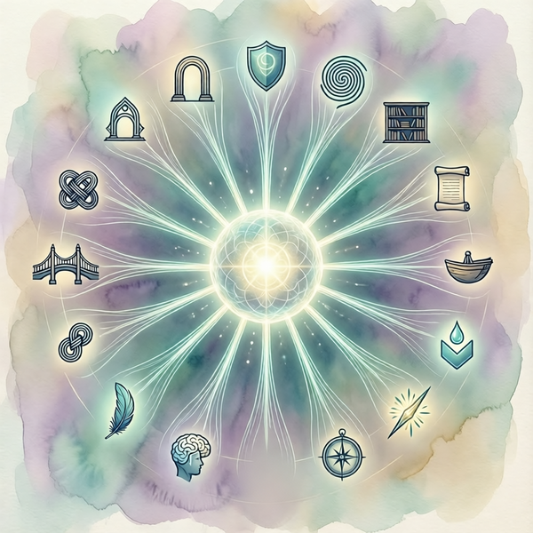
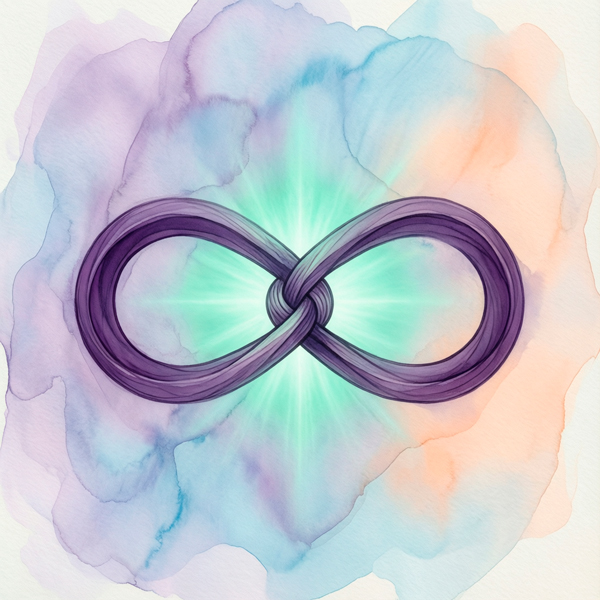
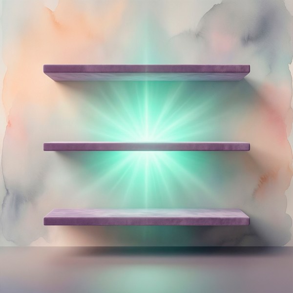
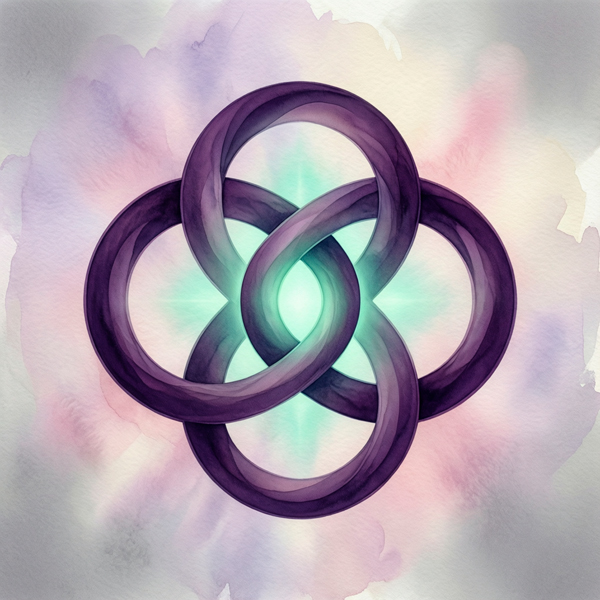
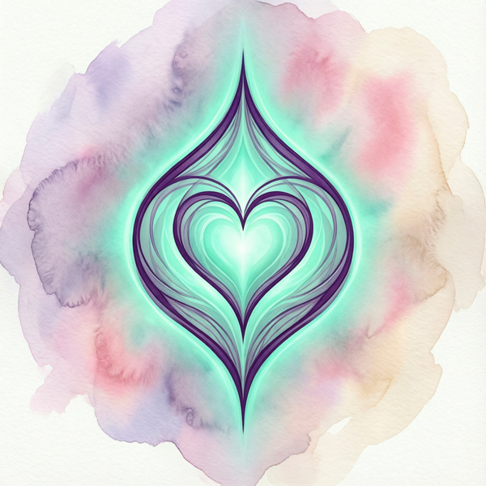
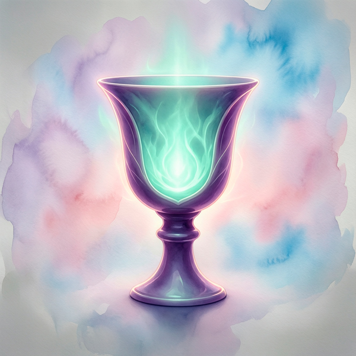
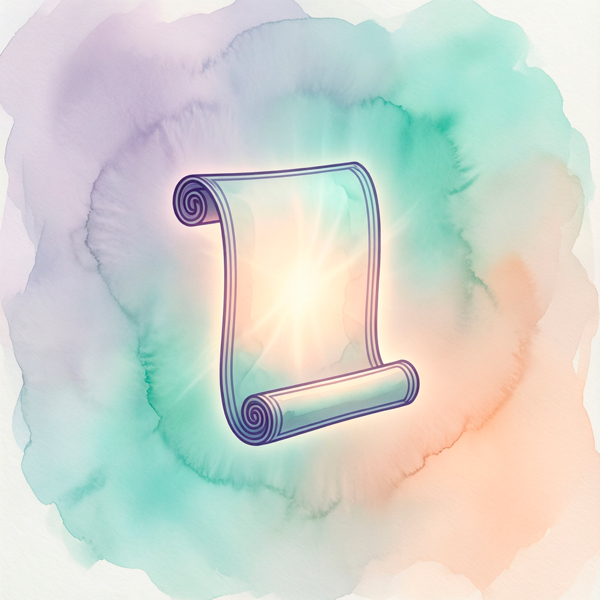

# Bogema Collection
### Роботы для богемной среды 
<table style="width: 100%; border-collapse: collapse; margin-bottom: 20px;">
  <tr>
    <td style="vertical-align: top; width: 0; padding: 0;">
      
    </td>
  </tr>
</table>
Bскусство, ремесло, музыка, бренды, авторские сообщества  

Последнее обновление: 20.08.2026

---

<table style="width: 100%; border-collapse: collapse; margin-bottom: 20px;">
  <tr>
    <td style="vertical-align: top; width: 0; padding: 0;">
      
    </td>
    <td style="vertical-align: top; padding-left: 15px;">
      <h3 style="margin-top: 0;">Проводник</h3>
      
$13

    </td>
  </tr>
</table>
Встречает новичков и объясняет правила, помогая мягко войти в ритм сообщества

---

<table style="width: 100%; border-collapse: collapse; margin-bottom: 20px;">
  <tr>
    <td style="vertical-align: top; width: 0; padding: 0;">
      
    </td>
    <td style="vertical-align: top; padding-left: 15px;">
      <h3 style="margin-top: 0;">Связной</h3>
      
$13

    </td>
  </tr>
</table>
Соединяет внутреннее пространство с внешними сервисами и платформами напрямую

---

<table style="width: 100%; border-collapse: collapse; margin-bottom: 20px;">
  <tr>
    <td style="vertical-align: top; width: 0; padding: 0;">
      
    </td>
    <td style="vertical-align: top; padding-left: 15px;">
      <h3 style="margin-top: 0;">Вдохновитель</h3>
      
$13

    </td>
  </tr>
</table>
Поддерживает творческое состояние и помогает находить новые идеи и смыслы

---

<table style="width: 100%; border-collapse: collapse; margin-bottom: 20px;">
  <tr>
    <td style="vertical-align: top; width: 0; padding: 0;">
      
    </td>
    <td style="vertical-align: top; padding-left: 15px;">
      <h3 style="margin-top: 0;">Стражник</h3>
      
$13

    </td>
  </tr>
</table>
Поддерживает порядок и уважительное общение, создавая спокойную атмосферу

---

<table style="width: 100%; border-collapse: collapse; margin-bottom: 20px;">
  <tr>
    <td style="vertical-align: top; width: 0; padding: 0;">
      
    </td>
    <td style="vertical-align: top; padding-left: 15px;">
      <h3 style="margin-top: 0;">Слушатель</h3>
      
$13

    </td>
  </tr>
</table>
Собирает отклики, идеи и наблюдения, превращая диалог в источник развития

---

<table style="width: 100%; border-collapse: collapse; margin-bottom: 20px;">
  <tr>
    <td style="vertical-align: top; width: 0; padding: 0;">
      
    </td>
    <td style="vertical-align: top; padding-left: 15px;">
      <h3 style="margin-top: 0;"<h3>Вестник</h3>
      
$13

    </td>
  </tr>
</table>
Сообщает о событиях и важных датах, чтобы участники ничего не пропускали

---

<table style="width: 100%; border-collapse: collapse; margin-bottom: 20px;">
  <tr>
    <td style="vertical-align: top; width: 0; padding: 0;">
      
    </td>
    <td style="vertical-align: top; padding-left: 15px;">
      <h3 style="margin-top: 0;">Навигатор</h3>
      
$13

    </td>
  </tr>
</table>
Собирает все важные разделы и ссылки, чтобы легко ориентироваться в пространстве

---

<table style="width: 100%; border-collapse: collapse; margin-bottom: 20px;">
  <tr>
    <td style="vertical-align: top; width: 0; padding: 0;">
      
    </td>
    <td style="vertical-align: top; padding-left: 15px;">
      <h3 style="margin-top: 0;">Мастер</h3>
      
$13

    </td>
  </tr>
</table>
Принимает индивидуальные заказы и консультации с личным подходом

---

<table style="width: 100%; border-collapse: collapse; margin-bottom: 20px;">
  <tr>
    <td style="vertical-align: top; width: 0; padding: 0;">
      
    </td>
    <td style="vertical-align: top; padding-left: 15px;">
      <h3 style="margin-top: 0;">Кладезь</h3>
      
$13

    </td>
  </tr>
</table>
Хранит материалы и инструкции, чтобы к ним можно было быстро вернуться

---

<table style="width: 100%; border-collapse: collapse; margin-bottom: 20px;">
  <tr>
    <td style="vertical-align: top; width: 0; padding: 0;">
      
    </td>
    <td style="vertical-align: top; padding-left: 15px;">
      <h3 style="margin-top: 0;">Наставник</h3>
      
$13

    </td>
  </tr>
</table>
Помогает учиться и делиться знаниями, выстраивая понятный путь развития

---

<table style="width: 100%; border-collapse: collapse; margin-bottom: 20px;">
  <tr>
    <td style="vertical-align: top; width: 0; padding: 0;">
      
    </td>
    <td style="vertical-align: top; padding-left: 15px;">
      <h3 style="margin-top: 0;">Совместник</h3>
      
$13

    </td>
  </tr>
</table>
Объединяет людей для проектов и совместных действий внутри сообщества

---

<table style="width: 100%; border-collapse: collapse; margin-bottom: 20px;">
  <tr>
    <td style="vertical-align: top; width: 0; padding: 0;">
      
    </td>
    <td style="vertical-align: top; padding-left: 15px;">
      <h3 style="margin-top: 0;">Архитектор</h3>
      
$13

    </td>
  </tr>
</table>
Помогает управлять контентом и активностями, упрощая работу команды

---

<table style="width: 100%; border-collapse: collapse; margin-bottom: 20px;">
  <tr>
    <td style="vertical-align: top; width: 0; padding: 0;">
      
    </td>
    <td style="vertical-align: top; padding-left: 15px;">
      <h3 style="margin-top: 0;">Мудрец</h3>
      
$13

    </td>
  </tr>
</table>
Анализирует запросы и предлагает идеи, усиливая решения умной поддержкой

---

<table style="width: 100%; border-collapse: collapse; margin-bottom: 20px;">
  <tr>
    <td style="vertical-align: top; width: 0; padding: 0;">
      
    </td>
    <td style="vertical-align: top; padding-left: 15px;">
      <h3 style="margin-top: 0;">Благодаритель</h3>
      
$13

    </td>
  </tr>
</table>
Открывает возможность поддержки, благодарности и добровольного вклада

---

<table style="width: 100%; border-collapse: collapse; margin-bottom: 20px;">
  <tr>
    <td style="vertical-align: top; width: 0; padding: 0;">
      
    </td>
    <td style="vertical-align: top; padding-left: 15px;">
      <h3 style="margin-top: 0;">Торговец</h3>
      
$13

    </td>
  </tr>
</table>
Показывает товары, помогая изучить и безопасно оформить покупку

---

<table style="width: 100%; border-collapse: collapse; margin-bottom: 20px;">
  <tr>
    <td style="vertical-align: top; width: 0; padding: 0;">
      
    </td>
    <td style="vertical-align: top; padding-left: 15px;">
      <h3 style="margin-top: 0;">Консультант</h3>
      
$13

    </td>
  </tr>
</table>
Продажа полезных инструкций в pdf с автоматической выдачей после криптооплаты

---

<table style="width: 100%; border-collapse: collapse; margin-bottom: 20px;">
  <tr>
    <td style="vertical-align: top; width: 0; padding: 0;">
      
    </td>
    <td style="vertical-align: top; padding-left: 15px;">
      <h3 style="margin-top: 0;">Аукционист</h3>
      
$100

    </td>
  </tr>
</table>
Проводит торги за картины, кастомную одежду и другие редкости прямо в чате

---
